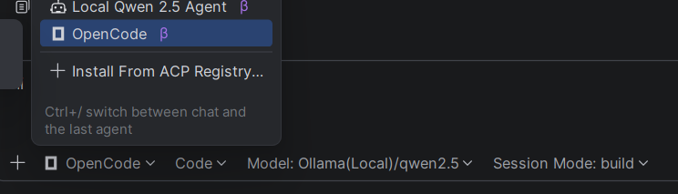

# Setup Intell-J + your Local LLM (optional):
Install [intellij idea](https://www.jetbrains.com/idea/) 2026 edition
## Integrate a local LLM with it to serve as mcp
Download and install [ollama](https://ollama.com/)
`irm https://ollama.com/install.ps1 | iex`

### [optional] Download and install Node.js using choco / msi:
```
powershell -c "irm https://community.chocolatey.org/install.ps1|iex"
choco install nodejs --version="24.16.0"
node -v # Should print "v24.16.0".
```
OR avoid all above and just install using the msi file: https://nodejs.org/en/download
ensure you can access the cli.

OR have wsl available
`wsl --install`


### OLLAMA/Openclaw

Models are defualted to download in these locations:

- `Windows`: C:\Users\%username%\.ollama\models
- `macOS`: ~/.ollama/models
- `Linux`: /usr/share/ollama/.ollama/models

Run a local model like QWEN2.5 (good for under 12GB VRAM GPUs)
```
ollama launch openclaw
ollama run qwen2.5-coder:7b
```
To Run Local LLM as agent in IntelliJ, follow :
- Enable chat mode [this](https://www.jetbrains.com/help/ai-assistant/use-custom-models.html#use-custom-models-in-ai-features):

Open code is really great to separately have a one-stop solution to an agentic UI to do stuff.

- [optional] Install the UI from https://opencode.ai/download
- Install the cli (required by ollama) using below command
```
  Set-ExecutionPolicy RemoteSigned -Scope CurrentUser
  npm install -g opencode-ai
 ```
- Launch OpenCode via OLLAMA:
`ollama launch opencode --config`
- Install the OpenCode ACP / AI Asisstant plugin
  
- if you want agent mode explicitly(without OpenCode) in Intellij, you have to add a config to %USERPROFILE%\.jetbrains\acp.json

```
{
  "default_mcp_settings": {
    "use_custom_mcp": true,
    "use_idea_mcp": true,
    "idea_mcp_allowed_tools": ["*"]
  },
  "agent_servers": {
    "Local Qwen 2.5 Agent": {
      "command": "qwen-agent",
      "args": ["--acp", "--model", "qwen2.5-coder", "--endpoint", "http://localhost:11434/v1"],
      "env": {
        "OPENAI_API_KEY": "ollama"
      }
    }
  }
}
```
